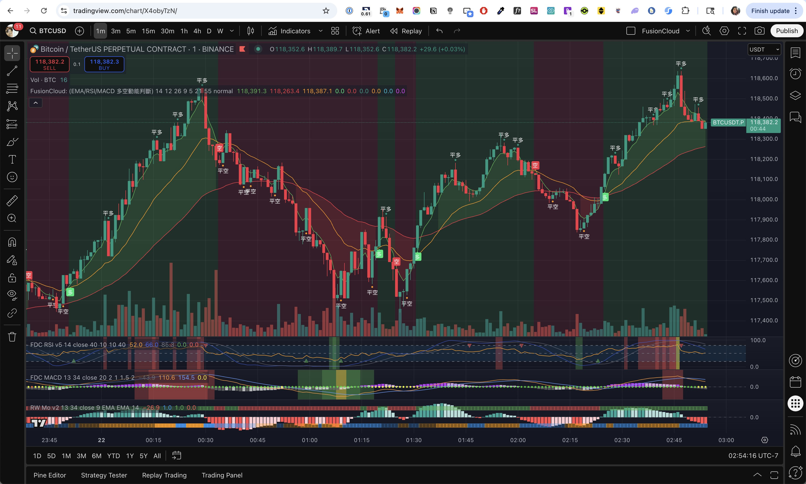
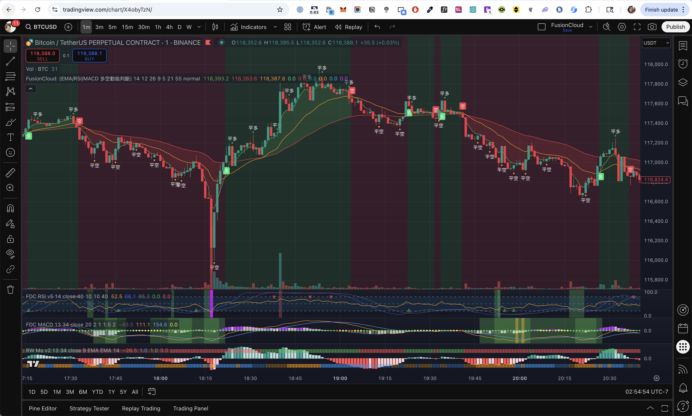

# FusionCloud: Triple Trend & Momentum System (EMA/RSI/MACD)

> Translated by ChatGPT. It's a bit awkward, but I'm a bit lazy to fix it.

| | |
|--|--|
|  |  |

**FusionCloud** is a powerful, all-in-one trend detection and entry/exit signal system designed for traders who want clear, confident decision-making across various market conditions.

This indicator fuses three key technical engines — **EMA cloud trend**, **RSI crossover**, and **MACD histogram momentum** — to provide precise long/short entry signals, customizable exit rules, and momentum burst detection.

#### <a href="README.md">🇹🇼 繁體中文</a> | 🇺🇸 English

## 🔍 Core Components

**1. EMA Trend Cloud**
- Uses 3 EMAs (short, mid, long) to define trend structure.
- Bullish when: EMA_fast > EMA_mid > EMA_slow
- Bearish when: EMA_fast < EMA_mid < EMA_slow
- Cloud is visually filled green (bull) or red (bear) for trend clarity.

**2. RSI & MACD-Based Entry Signals**
- Long entry: RSI crosses above its SMA + MACD histogram > 0 + bullish EMA alignment.
- Short entry: RSI crosses below its SMA + MACD histogram < 0 + bearish EMA alignment.
- Additional momentum-based entries triggered by accelerating MACD histogram & RW Momentum confirmation.

**3. Exit Signal Logic (Custom Sensitivity)**
- Three exit sensitivity modes: high, normal, low.
- Combines RSI crossback, MACD histogram reversal, and RW Momentum shift for robust exits.
- High sensitivity exits earlier; low sensitivity waits for full alignment.

**4. Momentum Burst Filter**
- Detects explosive breakouts via 3-bar MACD acceleration + same-direction RWMo.
- Helps catch trend continuation moves early.

**5. Reversal Potential Hints**
- Tiny triangle markers appear when RSI, MACD, and RW Momentum all align in the opposite direction.
- Not direct signals, but hints to prepare for potential reversals.

## 🎯 How to Use
- Long/Short Entry: Wait for green/red label ("多" / "空") on the candle.
- Exit Position: "平多" / "平空" label will appear with exit recommendation.
- Trend Background: Light green = currently in long; light red = currently in short.
- Sensitivity Setting: Choose exit aggressiveness via the settings panel.
- Alerts: All key signal types (entry, exit, reversal) can be set as TradingView alerts.

## ✅ Recommended Use
- Works well on crypto, forex, and index futures, especially on 1–15 minute charts.
- Not a repainting system.
- Designed for scalping, day trading, and swing setups.